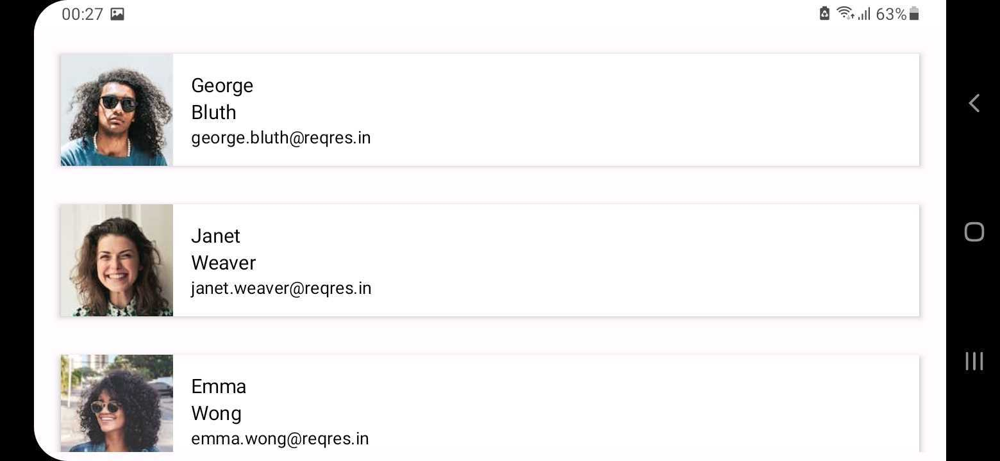

<h1>Exxceliq Solutions Assignment</h1>
<h3>An Android Application showcasing Pagination along with Clean Architecture along with Caching</h3>

Screenshots from the application : 

|  |  | | |
|----------|:----------:|:--------:|:--------:|

<h3>Architecture Used</h3>

## Tech stack 

- [Kotlin][1] based
- [Coroutines][2] for asynchronous.
- [Compose][3] - Modern toolkit for building native UI.
- [Lifecycle][4] - Create a UI that automatically responds to lifecycle events.
- [LiveData][5] - Notify domain layer data to views.
- [Navigation][6] - Handle everything needed for in-app navigation.
- [ViewModel][7] - UI-related data holder, lifecycle aware.
- [Hilt][8] - For [dependency injection][10].
- [Coil][9] - An image-loading library for Android backed by Kotlin Coroutines.

[1]: https://kotlinlang.org/
[2]: https://kotlinlang.org/docs/reference/coroutines-overview.html
[3]: https://developer.android.com/jetpack/compose
[4]: https://developer.android.com/topic/libraries/architecture/lifecycle
[5]: https://developer.android.com/topic/libraries/architecture/livedata
[6]: https://developer.android.com/jetpack/compose/navigation
[7]: https://developer.android.com/topic/libraries/architecture/viewmodel
[8]: https://dagger.dev/hilt/
[9]: https://developer.android.com/training/dependency-injection/hilt-android
[10]: https://github.com/coil-kt/coil

## Features

- Jetpack Compose UI. 
- Jetpack Compose Navigation
- MVVM Architecture
- Dependency injection with Hilt
- Retrieves Data from the network using Retrofit 
- Documented Flow 

## Project Structure:

- di (Dependency Injection): This directory  contains classes for managing dependencies throughout your project. 
- data (Data Access Layer): This directory encapsulates all data-related concerns:
    * local (Local Data):
        * dao (Data Access Objects): Classes that interact with  local database, providing methods for CRUD operations.
        * entity (Data Entities): Plain Java objects (POJOs) representing the data stored in local database 
        * database (Database Helper): Classes that manage local database creation, upgrade, and deletion 
    * remote (Remote Data):
        * dto (Data Transfer Objects): Classes representing the data structure received from remote API.
        * api (API Service): Interfaces defining methods for interacting with your API.
- repository (Data Repository): This directory contains classes that act as a single source of truth for accessing data, mediating between local and remote sources. These leverage libraries like Room and Retrofit.
    * paging (Paging): Classes related to fetching data in a paginated manner for optimized performance.
    * repo (Repository Implementation): Implementation classes for the repository interfaces, handling data retrieval, caching, and error handling.
- domain (Domain Layer): This directory houses application's core business logic, independent of how data is stored or accessed:
    * model (Domain Models): POJOs representing the core concepts and business rules of the app. These typically map to local entities 
    * repository (Domain Repository): Interfaces defining the domain-specific data access methods used by use cases.
    * usecase (Use Cases): Classes encapsulating specific functionalities or interactions within app. They retrieve data from the repository and perform transformations as needed for the presentation layer.
- presentation (Presentation Layer): This directory encompasses UI-related components:
- util (Utility Classes): This directory contains helper classes with general-purpose functions reusable across the app.
- ui/Theme (Jetpack Compose Theme): This folder contains classes defining app's visual theme using Jetpack Compose.

  
Class Responsibilities:
* DAO: Provides methods for CRUD operations on local database.
* Entity: Represents a data object stored in the local database.
* API Service: Defines methods for making requests to remote API.
* DTO: Represents the data structure received from the remote API.
* Repository: Acts as a single point of access for data, handling retrieval from local or remote sources.
* Domain Model: Represents a domain concept with business logic independent of data storage.
* Domain Repository: Provides domain-specific data access methods for use cases.
* Use Case: Encapsulates a specific app functionality, retrieving data from repositories and potentially transforming it for presentation.
* UI Components: Represent the visual elements displayed on the screen 
* Utility Classes: Contain general-purpose functions used throughout the app.

## Testing 
Make sure to pre-fill Database with dummy data before testing 

- Running Unit Tests

  Unit tests are isolated tests that focus on the functionality of individual classes or units of code without relying on external dependencies like the UI or network.

  Instructions:
1. Locate Unit Tests: Unit tests are placed in the src/test/java directory of the Android module.
2. Run Tests from Android Studio:
3. Open the Test view (View > Tool Windows > Test).
4. Select the test class or package you want to run:
5. To run all tests in a class: Click the green play button next to the class name.
   To run a specific test: Right-click on the test method and choose "Run 'testMethodName'".
   The test results will be displayed in the Test view, indicating success, failure, or errors.

- Running UI Tests (Instrumented Tests)
  UI tests verify the behavior of your app's user interface and interactions. They require an emulator or physical device to run.

  Instructions:
1. Locate UI Tests:  UI tests (instrumented tests) are placed in the androidTest/java directory of the Android module.
2. Set Up Dependencies: Ensure build.gradle file for the app module is synced.
3. Run Tests from Android Studio:
4. Connected Devices: Connect an emulator or physical device to your computer.
5. Open the Test view.
   Select the test class or package you want to run.
   Click the green play button.
   Android Studio will deploy the test app to the connected device and run the UI tests.

## Future Scope
  
- Animations 
- Code Optimisations

## Tested on devices 

- Oneplus 9 pro 
- Samsung S20 FE
- Samsung A31 
- Samsung M31s 
- Pixel Emulators 
